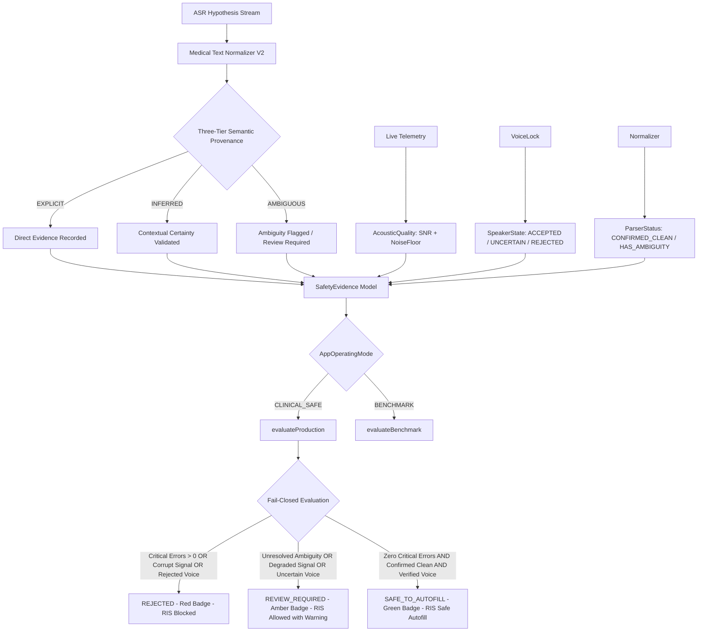

# AutoRIS: Clinical Safety Architecture & Zero-Tolerance Policy

## 1. Clinical Safety Rationale

In Diagnostic Radiology (Chẩn đoán hình ảnh - CĐHA), transcription inaccuracies carry direct patient morbidity and mortality risks:
- **Lesion size mutations:** Converting `21 mm` to `121 mm` or `2.1 mm` transforms an indeterminate nodule into an urgent surgical resection or false-negative discharge.
- **Unit mismatch:** `21 × 8 mm` misidentified as `21 × 8 cm` is clinically catastrophic.
- **Vertebral level mutations:** Transcribing `L4-L5` as `L5-S1` causes wrong-site spine surgery.
- **Laterality flips:** Confusing `phải` (right) with `trái` (left) causes wrong-side nephrectomy or thoracentesis.
- **Negation reversals:** Dropping `không` turns *"không thấy tổn thương"* into *"thấy tổn thương"*, causing misdiagnosis, unnecessary biopsies, and severe malpractice liability.

AutoRIS enforces a **strict Zero-Tolerance (0% Error Rate)** policy for all clinical measurements, units, spine levels, lateralities, and negations.

---

## 2. Fail-Closed Safety Gate Architecture

### Tri-State Evidence Status
Evidence in AutoRIS is strictly tri-state:
- `VALID`: Verified authentic, within safety thresholds.
- `INVALID`: Explicitly violates clinical rules (e.g. laterality conflict).
- `UNKNOWN`: Missing or unmeasured evidence. **Crucially, UNKNOWN evidence fails closed and will never permit `SAFE_TO_AUTOFILL`**.

---

## 3. Production vs Benchmark Separation

| Dimension | Production Mode (`CLINICAL_SAFE`) | Benchmark Mode (`BENCHMARK`) |
| :--- | :--- | :--- |
| **Ground Truth Reference** | **DOES NOT EXIST** in live patient dictations | Available via standard test sentences |
| **Primary Safety Metrics** | Multi-evidence verification: Speaker verification, Acoustic SNR, Entity provenance, Conflict absence | CER, WER, RTF, Token F1, Critical Error counts |
| **Auto-decision Logic** | Structural evidence gating | Threshold checks on CER ($< 3.0\%$) and zero critical errors |
| **PACS / RIS Export** | Strictly guarded: Blocked on `REJECTED`, Flagged on `REVIEW_REQUIRED` | Allowed for audit log harvesting |

---

## 4. Normalizer V2: 3-Tier Semantic Certainty

1. **`EXPLICIT`:**
   The doctor explicitly enunciated the unit or value:
   *"nang thận kích thước hai mươi mốt nhân tám milimet"* $\rightarrow$ `21 × 8 mm` (`EXPLICIT`).
2. **`INFERRED`:**
   In diagnostic radiology, single-integer and 2D dimensions without units default to `mm`:
   *"đường kính 15"* $\rightarrow$ `15 mm` (`INFERRED`).
3. **`AMBIGUOUS`:**
   Isolated bare numbers that cannot be structurally associated with an anatomical finding or dimension:
   *"ghi nhận 45 tổn thương"* $\rightarrow$ number `45` without unit, triggers `HAS_AMBIGUITY` and demotes status to `REVIEW_REQUIRED`.

---

## 5. Structured Failure Mode Taxonomy

The `AccuracyEvaluator` identifies seven mutually exclusive clinical failure categories:

1. `NUMBER_MISMATCH`: Numeric values mutated (e.g. `21` $\rightarrow$ `121`).
2. `UNIT_MISMATCH`: Measurement units changed (e.g. `mm` $\rightarrow$ `cm`).
3. `DIMENSION_MISMATCH`: 2D/3D lesion dimensions altered.
4. `SPINE_LEVEL_MISMATCH`: Vertebral level mutated (`L4-L5` $\rightarrow$ `L5-S1`).
5. `NEGATION_FLIP`: Diagnostic negation flipped (`không thấy` dropped).
6. `LATERALITY_MISMATCH`: Anatomical side inverted (`phải` $\rightarrow$ `trái`).
7. `CRITICAL_ANATOMY_OMISSION`: Essential anatomical organ omitted from report.

---

## 6. Clinical Safety Verification Suite

Every release of AutoRIS must achieve 100% pass rate on `ClinicalRegressionTest.kt`, verifying:
- Historical case regressions (stomach wall `21 mm`, lymph node `21 × 8 mm`, liver `9 mm`, spine `L4-L5`).
- Exact regex token boundary verification preventing substring match exploits.
- Immediate fail-closed rejection on contradictory anatomical lateralities.
