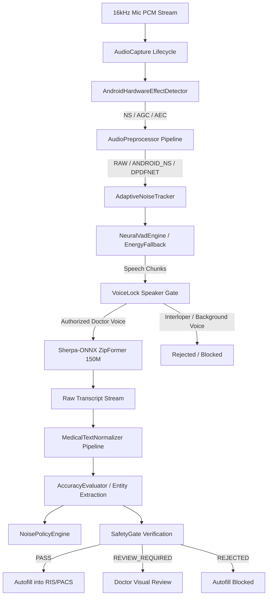

# AutoRIS: Robust Multi-Room Noise Pipeline & Clinical ASR Architecture

## 1. Executive Summary & Design Constraints

AutoRIS is an on-device Vietnamese Automatic Speech Recognition (ASR) dictation engine designed specifically for diagnostic radiology (CĐHA). Running on high-performance mobile SoCs (Snapdragon 8 Gen 3 on Samsung Galaxy S24 Ultra and OnePlus Ace 5), the system executes inference **100% locally** using Sherpa-ONNX with 4 CPU threads.

### Primary Directives:
1. **Zero Cloud Dependencies:** No cloud APIs (no OpenAI, Gemini, Azure, Google Speech API). Zero audio leaves the local device.
2. **Preserved Reference Model:** `hynt/ZipFormer-150M-CR-CTC-RNNT` (offline 4 threads) remains the primary accuracy baseline.
3. **Zero-Tolerance Clinical Errors:** Absolute zero tolerance for inaccuracies in measurements, dimensions, vertebral spine levels, laterality (trái vs phải), and diagnostic negations (không có vs có).
4. **Real-Time Responsiveness:** Real-Time Factor (RTF) $\le 0.25$ and P95 latency $\le 450$ ms.

---

## 2. End-to-End Pipeline Architecture



---

## 3. Preprocessing DSP Profiles

AutoRIS defines five discrete preprocessing profiles tailored for diverse hospital acoustic zones:

| Profile ID | Description | Typical Floor | Overhead | Best Suited Clinical Zone |
| :--- | :--- | :---: | :---: | :--- |
| `RAW` | Bypass all filters; pristine 16kHz PCM | $< -50$ dB | 0% | Quiet reading room (`ROOM_01`) |
| `ANDROID_NS` | OS-level hardware `NoiseSuppressor` | $-50$ to $-42$ dB | $<1$% | Ultrasound (`ROOM_US`), steady AC |
| `ANDROID_NS_AGC` | Hardware `NoiseSuppressor` + `AutomaticGainControl` | $-44$ to $-38$ dB | $<1.5$% | CT control room (`ROOM_CT`), distant mic ($>35$ cm) |
| `DPDFNET` | Deep dual-path differential neural denoiser | $-40$ to $-32$ dB | $4-6$% | MRI console room (`ROOM_MRI`), chiller/gradient noise |
| `ANDROID_NS_DPDFNET` | Cascaded hardware NS + DPDFNet | $> -32$ dB | $5-7$% | Angio suite (`ROOM_ANGIO`), ER reading desk (`ROOM_ER`) |

---

## 4. Adaptive Noise Tracking & Hysteresis

The `AdaptiveNoiseTracker` continuously measures environmental noise dynamics:
- **Sliding Percentile Window:** Tracks the 15th percentile energy of a 3-second window (30 chunks $\times$ 100 ms).
- **Rapid Calibration:** Enables instantaneous 1-second background calibration upon entering a new room.
- **Dynamic Thresholding:** Speech threshold = $\text{Floor} + 7$ dB; Silence threshold = $\text{Floor} + 3$ dB.

### Policy Engine with Hysteresis
To prevent "ping-pong" oscillations around threshold boundaries (e.g., when AC or chiller cycles on and off):
- The `NoisePolicyEngine` requires **3 consecutive evaluations** before transitioning between profiles.
- Provides a manual override mode that lets doctors freeze the profile while continuing telemetry logging.

---

## 5. Neural VAD & Voice Lock (Speaker Gate)

### Dual-Engine VAD
1. **`NeuralVadEngine`:** Silero-compatible ONNX streaming model with recurrent hidden states, detecting subtle human vocal tract formants under heavy machinery noise.
2. **`EnergyVadEngine`:** Graceful, zero-latency fallback operating on RMS dB relative to the adaptive noise floor.

### Voice Lock (Speaker Gate)
Radiology reading rooms often host consultations, phone calls, and technologist queries. `VoiceLock`:
- Extracts a 64-dimensional acoustic spectral feature vector from the primary radiologist's speech.
- Evaluates real-time cosine similarity:
  - $\text{Similarity} \ge 0.65$: `ACCEPT`
  - $\text{Similarity} \le 0.40$: `REJECT` (autofill strictly blocked)
  - $0.40 < \text{Similarity} < 0.65$: `UNCERTAIN` (flags review requirement)

---

## 6. Modularized Medical Text Normalization Pipeline

The normalization engine converts conversational Vietnamese medical speech into standardized clinical reports through 8 deterministic parsers:

1. **`SpineLevelParser`:** Resolves vertebral levels (e.g., *"L bốn năm"* $\rightarrow$ `L4-L5`, *"C năm C sáu"* $\rightarrow$ `C5-C6`, *"thoát vị đĩa đệm D mười hai L một"* $\rightarrow$ `D12-L1`).
2. **`VietnameseNumberParser`:** Converts spelled-out numbers (*"hai mốt"* $\rightarrow$ `21`, *"bốn mươi lăm"* $\rightarrow$ `45`).
3. **`DimensionParser`:** Standardizes multi-dimensional measurements (*"hai mươi mốt nhân tám milimét"* $\rightarrow$ `21 × 8 mm`). Employs strict word boundaries to prevent lookahead backtracking bugs.
4. **`RangeParser`:** Normalizes numerical ranges (*"từ năm đến mười milimét"* $\rightarrow$ `5 - 10 mm`).
5. **`PercentageParser`:** Handles ratios and percentages (*"hẹp sáu mươi phần trăm"* $\rightarrow$ `hẹp 60%`).
6. **`VolumeParser`:** Parses 3D volumes (*"dung tích một trăm năm mươi mililít"* $\rightarrow$ `150 ml`).
7. **`MeasurementParser`:** Attaches standardized SI units (`mm`, `cm`, `HU`, `ml`, `mg/dl`).
8. **`MedicalPhraseNormalizer`:** Capitalizes clinical findings and normalizes standard radiology acronyms (`CT`, `MRI`, `DSA`, `X-quang`, `T1W`, `T2W`, `FLAIR`).

---

## 7. Zero-Tolerance Clinical Safety Gate

To guarantee patient safety, `SafetyGate` evaluates every transcription before allowing autofill into hospital information systems:

```
                  ┌───────────────────────────────┐
                  │ ASR Transcript & Evaluation   │
                  └──────────────┬────────────────┘
                                 │
                 ┌───────────────┴───────────────┐
                 │ Critical Diagnostic Error?    │
                 │ - Numeric / Measurement Mismatch?
                 │ - Negation Inverted? (có/không)
                 │ - Laterality Reversed? (phải/trái)
                 │ - Spine Level Mismatch?
                 └───────────────┬───────────────┘
                        YES      │      NO
          ┌──────────────────────┘       │
          ▼                              ▼
    ┌──────────┐            ┌────────────────────────┐
    │ REJECTED │            │ CER < 3% & Conf > 0.90 │
    │ (Blocked)│            └────────────┬───────────┘
    └──────────┘                   YES   │   NO
                             ┌───────────┘    │
                             ▼                ▼
                     ┌────────────────┐ ┌─────────────────┐
                     │SAFE_TO_AUTOFILL│ │ REVIEW_REQUIRED │
                     │(Direct RIS/PACS│ │ (Doctor Visual  │
                     │   Injection)   │ │  Confirmation)  │
                     └────────────────┘ └─────────────────┘
```

---

## 8. Verification & Test Suite

All 15 implementation phases are verified by automated unit tests running on JVM:
- `AudioPreprocessingTest.kt`: Hardware effect detection, profile cascades, fallback modes.
- `AdaptiveNoiseTrackerTest.kt`: Percentile energy sliding window, 1s calibration, noise levels.
- `VadEngineTest.kt`: Neural Silero ONNX pipeline and Energy VAD fallbacks.
- `VoiceLockTest.kt`: Feature vector extraction, cosine similarity, accept/reject decisions.
- `MedicalNormalizerTest.kt`: 31 regression cases covering complex dimensions, spine levels, and units.
- `AccuracyEvaluatorTest.kt`: 35 tests covering structured entity extraction and critical error triggers.
- `EnglishFrontendBenchmarkTest.kt`: Multi-track benchmark runner with 8 synthetic clinical cases.
- `ScenarioMatrixTest.kt`: Validates 6 rooms, 5 profiles, and 12 matrix scenarios against schema.
- `NoisePolicyEngineTest.kt`: Acoustic environment classification, hysteresis debounce, and manual override.
- `SafetyGateTest.kt`: Complete validation of `SAFE_TO_AUTOFILL`, `REVIEW_REQUIRED`, and `REJECTED` states.
